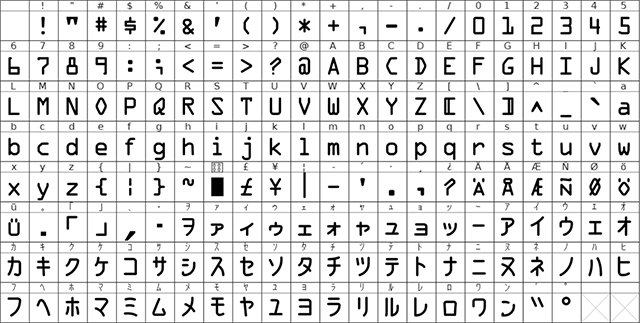

# OCR-AK



OCR-AK is **NONSTANDARD** OCR font.
ANSI characters are derived from OCR-A(ANSI X3.17-1977),
and JIS characters are from OCR-BK(JIS X 9003-1980).

In process of combining two, breaks the above specifications,
and so **DO NOT USE** as alternatives on commercial or industrial
field that expect OCR-BK.

## Build

```bash
fontforge --script build.py
```

- Tested on FontForge 08:20 UTC 31-Jul-2017, Windows 10

## License

- OCR-AK, 2018 Retorillo (CC0)
- [OCR-A](https://sourceforge.net/projects/ocr-a-font/), 2018 Jonh Sauter (Public Domain)
- [OCR-BKxStd](http://force4u.cocolog-nifty.com/skywalker/2010/07/ocrocr-bkw-9d5e.html), 2010 force4u (CC0)

